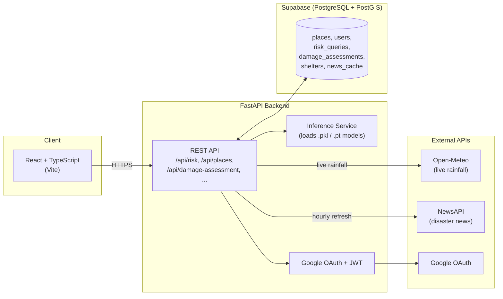
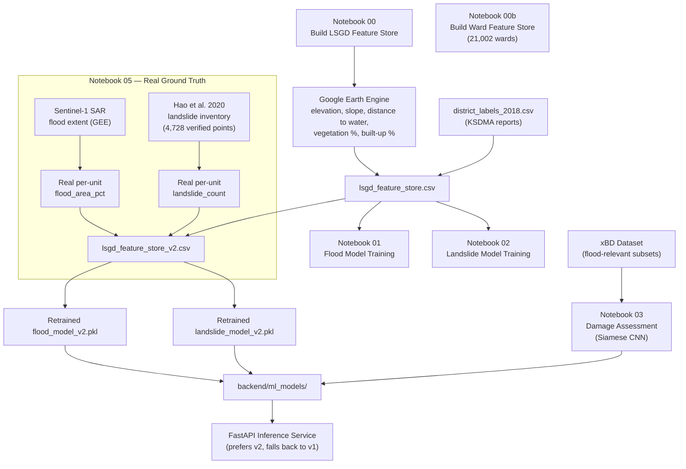

# DIP Kerala — Disaster Intelligence Platform

An AI-powered flood and landslide risk prediction system for Kerala, built at the
granularity of all **1,034 LSGD units** (panchayats, municipalities, corporations),
with post-disaster damage assessment from satellite imagery.

Search any place in Kerala and get live flood risk, landslide risk, and current
weather — combining static terrain data (Google Earth Engine) with live rainfall
(Open-Meteo) through trained ML models.

---

## Table of contents

- [Architecture](#architecture)
- [Data pipeline](#data-pipeline)
- [Features](#features)
- [Tech stack](#tech-stack)
- [Model performance — reported honestly](#model-performance--reported-honestly)
- [Project structure](#project-structure)
- [Setup](#setup)
- [API reference](#api-reference)
- [Known limitations](#known-limitations)

---

## Architecture



---

## Data pipeline

Terrain features are computed **once, offline**, in Google Earth Engine, then stored
in Supabase — the backend never calls GEE at request time. Only rainfall is fetched
live, since it's the one input that changes day to day.



**Why Notebook 05 exists:** the original labels (`flood_occurred`,
`landslide_risk_level`) were only known at **district level** (14 districts) from
2018 KSDMA reports — every LSGD in the same district shared an identical label. That
capped honest accuracy at 50.8% (flood) and 17.7% (landslide), regardless of model
tuning. Notebook 05 replaces those with genuine per-unit ground truth: real
Sentinel-1 SAR flood-extent mapping and a published, citable landslide inventory.

---

## Features

- **Live risk query** — type a place name, get flood probability, landslide risk
  tier, and current weather in one response
- **Interactive map dashboard** with risk overlays
- **Post-disaster damage assessment** — upload a pre/post satellite image pair, get
  a tile-level damage classification (No Damage / Minor / Major / Destroyed)
- **District-wide alert scanning** — batch flood-risk scan across all LSGD units
- **Live Kerala disaster news feed** (hourly refresh, cached)
- **Emergency helplines & shelters**, per district
- **User-submitted places** with an admin approval workflow
- **Google OAuth login**

---

## Tech stack

| Layer | Technology |
|---|---|
| Frontend | React, TypeScript, Vite, Tailwind |
| Backend | FastAPI, Python, SQLAlchemy |
| Database | PostgreSQL + PostGIS (Supabase) |
| ML — flood/landslide | RandomForest / XGBoost / LightGBM (scikit-learn) |
| ML — damage assessment | Siamese CNN, ResNet18 backbone (PyTorch) |
| Geospatial data | Google Earth Engine (SRTM DEM, Sentinel-1 SAR, JRC Global Surface Water, ESA WorldCover, HydroSHEDS) |
| Live weather | Open-Meteo API |
| Auth | Google OAuth 2.0 + JWT |
| Notebooks | Google Colab |

---

## Model performance — reported honestly

This project deliberately surfaces **honest, district-grouped validation accuracy**
in the UI rather than an inflated random-split number. See
[`notebooks/05_Real_Ground_Truth_and_Retrain.ipynb`](notebooks/05_Real_Ground_Truth_and_Retrain.ipynb)
for the full methodology.

| Model | v1 (district-copied labels) | v2 (real per-unit ground truth) |
|---|---|---|
| Flood | 50.8% honest accuracy | 87.3% honest accuracy |
| Landslide | 17.7% honest accuracy | 85.3% honest accuracy |
| Damage assessment | — | 64.7% accuracy, 0.55 macro-F1 |

**Important caveat:** the v2 real labels turned out far more imbalanced than the old
district-copied ones (most places genuinely didn't flood in 2018). A model that
always guesses the majority class would already score ~79–83% on these labels — so
**macro-F1, saved alongside accuracy in the `*_accuracy_v2.json` files, is the more
honest number to quote**, not accuracy alone. The landslide model in particular has
near-zero recall on the "High" risk tier.

---

## Project structure

```
DIP_Kerala_project_final/
├── backend/
│   ├── main.py                  # FastAPI app entrypoint
│   ├── db/                      # SQLAlchemy models, session, seed scripts
│   ├── routers/                 # API route handlers
│   ├── services/                # Inference, weather, news, helplines
│   ├── ml_models/               # Trained .pkl / .pt models + accuracy JSONs
│   └── data/                    # LSGD boundaries, feature stores
├── frontend/
│   └── src/
│       ├── pages/               # Dashboard, Alerts, Damage Assessment, etc.
│       ├── components/
│       └── lib/api.ts           # Backend API client
└── notebooks/
    ├── 00_Build_LSGD_Feature_Store.ipynb
    ├── 00b_Build_Ward_Feature_Store.ipynb
    ├── 01_Flood_Prediction_Model.ipynb
    ├── 02_Landslide_Prediction_Model.ipynb
    ├── 03_Damage_Assessment_Model.ipynb
    ├── 04_Combined_Live_Risk_Query.ipynb
    └── 05_Real_Ground_Truth_and_Retrain.ipynb
```

---

## Setup

### Backend

```bash
cd backend
python -m venv venv
venv\Scripts\activate        # Windows
# source venv/bin/activate   # macOS/Linux

pip install -r requirements.txt
cp .env.example .env         # then fill in real values

python db/seed_places.py
python db/seed_helplines.py

uvicorn main:app --reload --port 8000
```

### Frontend

```bash
cd frontend
npm install
npm run dev
```

### Environment variables (`backend/.env`)

| Variable | Purpose |
|---|---|
| `DATABASE_URL` | Supabase/PostgreSQL connection string |
| `GOOGLE_CLIENT_ID` / `GOOGLE_CLIENT_SECRET` | Google OAuth login |
| `JWT_SECRET_KEY` | Signs session tokens |
| `NEWSAPI_KEY` | Hourly disaster news feed |
| `FRONTEND_URL` / `BACKEND_URL` | Redirect URLs for OAuth |

---

## API reference

| Endpoint | Method | Description |
|---|---|---|
| `/api/risk/{place_name}` | GET | Live flood + landslide risk for a place |
| `/api/risk/alerts` | GET | Scan all LSGD units above a flood-risk threshold |
| `/api/places` | GET | All ~1,034 places with terrain features |
| `/api/places/search?q=` | GET | Fuzzy place name search |
| `/api/damage-assessment` | POST | Upload pre/post images, get damage classification |
| `/api/damage-assessment/{place_id}/history` | GET | Past assessments for a place |
| `/api/helplines` | GET | Emergency contacts (national + district) |
| `/api/shelters` | GET | Active shelters |
| `/api/news` | GET | Cached Kerala disaster news |
| `/api/auth/google/login` | GET | Start Google OAuth flow |
| `/api/admin/submissions` | GET/POST | Review user-submitted places |

Full interactive docs available at `/docs` once the backend is running.

---

## Known limitations

- **Ground truth is one event-year (2018)** for both flood and landslide real
  labels. More independent event-years would further reduce validation variance.
- **Admin endpoints have no role system yet** — any logged-in user can approve/reject
  place submissions. Flagged explicitly in `routers/admin.py`.
- **Damage assessment images aren't persisted to storage** — the upload endpoint
  classifies but doesn't yet save images to S3/Cloud Storage (`routers/damage.py`).
- **Damage assessment is tile-level, not building-level** — a deliberate scoping
  decision documented in Notebook 03; full building-level segmentation (xView2-style)
  is future work.
- **User-submitted places have no terrain data** until Notebook 00's GEE extraction
  is re-run to include them — risk queries for them will 422 until then.

---

## Credits

Built by Santhanu, final-year CSE (Data Science), guided by Dr. Soumya Haridas, with
Nanditha M Menon and Basil Binu.
