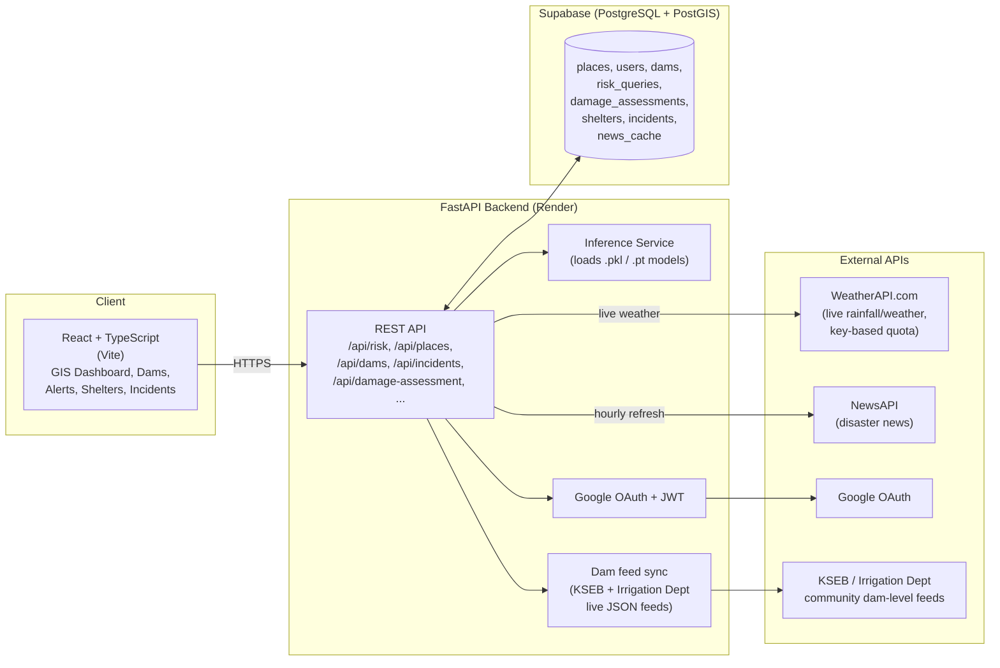
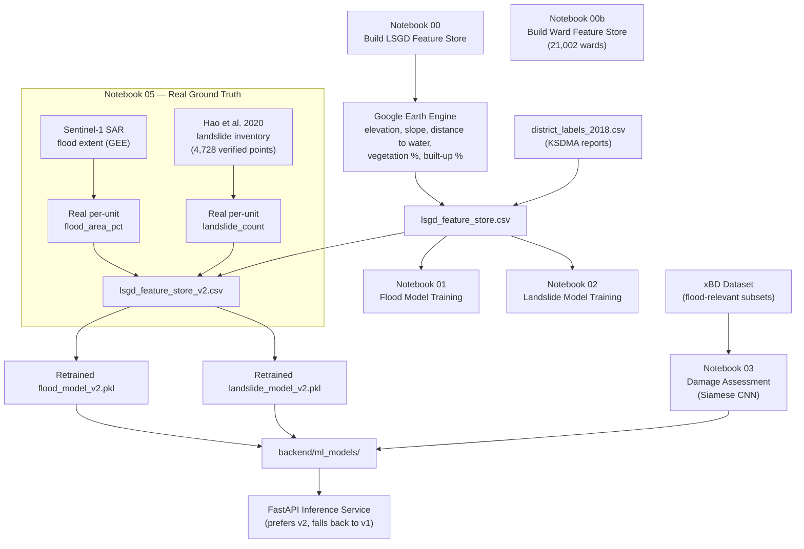

# DIP Kerala — Disaster Intelligence Platform

An AI-powered flood and landslide risk prediction system for Kerala, built at the
granularity of all **1,034 LSGD units** (panchayats, municipalities, corporations),
with post-disaster damage assessment from satellite imagery, live dam water-level
monitoring, and a GIS risk heatmap dashboard.

Search any place in Kerala and get live flood risk, landslide risk, and current
weather — combining static terrain data (Google Earth Engine) with live rainfall
(WeatherAPI.com) through trained ML models.

**Live:** [dip-kerala-frontend.vercel.app](https://dip-kerala-frontend.vercel.app) ·
Backend API: [dip-kerala-backend.onrender.com](https://dip-kerala-backend.onrender.com) ·
Docs: `/docs` on the backend URL

---

## Table of contents

- [Architecture](#architecture)
- [Data pipeline](#data-pipeline)
- [Features](#features)
- [Tech stack](#tech-stack)
- [Model performance — reported honestly](#model-performance--reported-honestly)
- [Project structure](#project-structure)
- [Setup](#setup)
- [Deployment](#deployment)
- [API reference](#api-reference)
- [Known limitations](#known-limitations)

---

## Architecture


```mermaid
flowchart LR
    subgraph Client
        FE["React + TypeScript\n(Vite)\nGIS Dashboard, Dams,\nAlerts, Shelters, Incidents"]
    end

    subgraph Backend["FastAPI Backend (Render)"]
        API["REST API\n/api/risk, /api/places,\n/api/dams, /api/incidents,\n/api/damage-assessment, ..."]
        INF["Inference Service\n(loads .pkl / .pt models)"]
        AUTH["Google OAuth + JWT"]
        DAMSYNC["Dam feed sync\n(KSEB + Irrigation Dept\nlive JSON feeds)"]
    end

    subgraph Data["Supabase (PostgreSQL + PostGIS)"]
        DB[("places, users, dams,\nrisk_queries,\ndamage_assessments,\nshelters, incidents,\nnews_cache")]
    end

    subgraph External["External APIs"]
        WA["WeatherAPI.com\n(live rainfall/weather,\nkey-based quota)"]
        NEWS["NewsAPI\n(disaster news)"]
        GOOGLE["Google OAuth"]
        KSEB["KSEB / Irrigation Dept\ncommunity dam-level feeds"]
    end

    FE -- HTTPS --> API
    API --> AUTH --> GOOGLE
    API --> INF
    API --> DAMSYNC --> KSEB
    API <--> DB
    API -- live weather --> WA
    API -- hourly refresh --> NEWS
```

---

## Data pipeline

Terrain features are computed **once, offline**, in Google Earth Engine, then stored
in Supabase — the backend never calls GEE at request time. Only rainfall/weather and
dam levels are fetched live, since those are the inputs that change day to day.


```mermaid
flowchart TD
    A["Notebook 00\nBuild LSGD Feature Store"] --> B["Google Earth Engine\nelevation, slope, distance to water,\nvegetation %, built-up %"]
    A2["Notebook 00b\nBuild Ward Feature Store\n(21,002 wards)"]

    B --> C["lsgd_feature_store.csv"]
    D["district_labels_2018.csv\n(KSDMA reports)"] --> C

    C --> E["Notebook 01\nFlood Model Training"]
    C --> F["Notebook 02\nLandslide Model Training"]

    G["xBD Dataset\n(flood-relevant subsets)"] --> H["Notebook 03\nDamage Assessment\n(Siamese CNN)"]

    subgraph V2["Notebook 05 — Real Ground Truth"]
        I["Sentinel-1 SAR\nflood extent (GEE)"] --> K["Real per-unit\nflood_area_pct"]
        J["Hao et al. 2020\nlandslide inventory\n(4,728 verified points)"] --> L["Real per-unit\nlandslide_count"]
        K --> M["lsgd_feature_store_v2.csv"]
        L --> M
    end

    C --> M
    M --> E2["Retrained flood_model_v2.pkl"]
    M --> F2["Retrained landslide_model_v2.pkl"]

    E2 --> N["backend/ml_models/"]
    F2 --> N
    H --> N
    N --> O["FastAPI Inference Service\n(prefers v2, falls back to v1)"]
```

**Why Notebook 05 exists:** the original labels (`flood_occurred`,
`landslide_risk_level`) were only known at **district level** (14 districts) from
2018 KSDMA reports — every LSGD in the same district shared an identical label. That
capped honest accuracy at 50.8% (flood) and 17.7% (landslide), regardless of model
tuning. Notebook 05 replaces those with genuine per-unit ground truth: real
Sentinel-1 SAR flood-extent mapping and a published, citable landslide inventory.

**Dam reference data** (`backend/db/dams_reference.csv`) is sourced dam-by-dam from
KSEB, the Kerala Irrigation Department, Wikipedia, and CEA daily reservoir bulletins
— static fields (river, owner, capacity, FRL, coordinates) only, never estimated.
Live water levels come from the community-maintained
[`amith-vp/Kerala-Dam-Water-Levels`](https://github.com/amith-vp/Kerala-Dam-Water-Levels)
feed for the ~18 dams KSEB/Irrigation actually telemeter; every other dam is shown
with static reference info only, honestly labeled as having no live feed.

---

## Features

- **Live risk query** — type a place name, get flood probability, landslide risk
  tier, and current weather in one response
- **GIS dashboard with risk heatmaps** — Kerala-wide flood and landslide risk shown
  as color-graded heatmap layers (dark green → light green → orange → red), active
  alert pins, and a dam-status layer (red = high risk, green = normal, grey = no
  live telemetry)
- **Live dam water-level monitoring** — real-time levels/storage % for telemetered
  dams, honest freshness checks (a stale reading is never shown as "live"), and
  static specs (river, owner, capacity, FRL) for dams with no live feed
- **Post-disaster damage assessment** — upload a pre/post satellite image pair, get
  a tile-level damage classification (No Damage / Minor / Major / Destroyed)
- **District-wide alert scanning** — batch flood-risk scan across all LSGD units
- **Crowdsourced incident reports** — flood/landslide/road-blocked reports from
  users, always disclosed as unverified community reports, never shown with the
  authority of a model prediction
- **Live Kerala disaster news feed** (hourly refresh, cached)
- **Emergency helplines & shelters**, per district, with user-submitted shelters
  going through an admin approval queue
- **User-submitted places** with an admin approval workflow
- **Google OAuth login**, plus a separate admin login for the review dashboards

---

## Tech stack

| Layer | Technology |
|---|---|
| Frontend | React, TypeScript, Vite, Tailwind, Leaflet (+ leaflet.heat for risk heatmaps) |
| Backend | FastAPI, Python, SQLAlchemy |
| Database | PostgreSQL + PostGIS (Supabase) |
| ML — flood/landslide | RandomForest / XGBoost / LightGBM (scikit-learn) |
| ML — damage assessment | Siamese CNN, ResNet18 backbone (PyTorch) |
| Geospatial data | Google Earth Engine (SRTM DEM, Sentinel-1 SAR, JRC Global Surface Water, ESA WorldCover, HydroSHEDS) |
| Live weather | WeatherAPI.com (key-based, dedicated quota — see [Setup](#setup)) |
| Live dam levels | Community-maintained KSEB/Irrigation Dept feed (`amith-vp/Kerala-Dam-Water-Levels`) |
| Auth | Google OAuth 2.0 + JWT |
| Hosting | Vercel (frontend), Render (backend), Supabase (database) |
| Notebooks | Google Colab |

---

## Model performance — reported honestly

This project deliberately surfaces **honest, district-grouped validation accuracy**
in the UI rather than an inflated random-split number. See
[`notebooks/05_Real_Ground_Truth_and_Retrain.ipynb`](notebooks/05_Real_Ground_Truth_and_Retrain.ipynb)
for the full methodology.

| Model | v1 (district-copied labels) | v2 (real per-unit ground truth) |
|---|---|---|
| Flood | 50.8% honest accuracy | 87.3% honest accuracy |
| Landslide | 17.7% honest accuracy | 85.3% honest accuracy |
| Damage assessment | — | 64.7% accuracy, 0.55 macro-F1 |

**Important caveat:** the v2 real labels turned out far more imbalanced than the old
district-copied ones (most places genuinely didn't flood in 2018). A model that
always guesses the majority class would already score ~79–83% on these labels — so
**macro-F1, saved alongside accuracy in the `*_accuracy_v2.json` files, is the more
honest number to quote**, not accuracy alone. The landslide model in particular has
near-zero recall on the "High" risk tier.

---

## Project structure

```
DIP_Kerala_project_final/
├── backend/
│   ├── main.py                  # FastAPI app entrypoint
│   ├── db/                      # SQLAlchemy models, session, seed scripts, dams_reference.csv
│   ├── routers/                 # places, risk, damage, auth, news, helplines, admin,
│   │                             #   incidents, dams
│   ├── services/                # Inference, weather (WeatherAPI.com), news, helplines
│   ├── ml_models/                # Trained .pkl / .pt models + accuracy JSONs
│   └── data/                     # LSGD boundaries, feature stores
├── frontend/
│   └── src/
│       ├── pages/                # Dashboard (GIS heatmap), Dams, Alerts, Incidents,
│       │                          #   Shelters, Damage Assessment, Analytics, Risk Manifest,
│       │                          #   Admin Review, Submit Place, Login, News, Home
│       ├── components/
│       └── lib/api.ts            # Backend API client
└── notebooks/
    ├── 00_Build_LSGD_Feature_Store.ipynb
    ├── 00b_Build_Ward_Feature_Store.ipynb
    ├── 01_Flood_Prediction_Model.ipynb
    ├── 02_Landslide_Prediction_Model.ipynb
    ├── 03_Damage_Assessment_Model.ipynb
    ├── 04_Combined_Live_Risk_Query.ipynb
    └── 05_Real_Ground_Truth_and_Retrain.ipynb
```

---

## Setup

### Backend

```bash
cd backend
python -m venv venv
venv\Scripts\activate        # Windows
# source venv/bin/activate   # macOS/Linux

pip install -r requirements.txt
cp .env.example .env         # then fill in real values

python db/seed_places.py
python db/seed_helplines.py
python db/seed_dams.py       # optional standalone run -- also runs automatically on startup

uvicorn main:app --reload --port 8000
```

### Frontend

```bash
cd frontend
npm install     # or: pnpm install -- the deployed site builds with pnpm, see pnpm-lock.yaml
npm run dev
```

### Environment variables (`backend/.env`)

| Variable | Purpose |
|---|---|
| `DATABASE_URL` | Supabase/PostgreSQL connection string |
| `GOOGLE_CLIENT_ID` / `GOOGLE_CLIENT_SECRET` | Google OAuth login |
| `JWT_SECRET_KEY` | Signs session tokens |
| `NEWSAPI_KEY` | Hourly disaster news feed |
| `WEATHERAPI_KEY` | Live rainfall/temperature/wind for the risk models (free, key-based quota at [weatherapi.com](https://www.weatherapi.com/signup.aspx)). Without it, weather falls back to a climatological estimate — the app still runs, just without real live weather |
| `ADMIN_EMAIL` / `ADMIN_PASSWORD` | Separate admin login for the submissions/shelter review dashboards. If either is unset, admin login is disabled entirely (fails closed) |
| `FRONTEND_URL` / `BACKEND_URL` | Redirect URLs for OAuth |

---

## Deployment

| Component | Host | Notes |
|---|---|---|
| Frontend | [Vercel](https://vercel.com) | Auto-deploys on push to `main`; builds with `pnpm` using `frontend/pnpm-lock.yaml` — keep it in sync with `package.json` or the build fails with `ERR_PNPM_OUTDATED_LOCKFILE` |
| Backend | [Render](https://render.com) (free tier, Singapore region) | Auto-deploys on push to `main`; cold starts can take up to ~60s on the free tier |
| Database | [Supabase](https://supabase.com) | PostgreSQL + PostGIS |

---

## API reference

| Endpoint | Method | Description |
|---|---|---|
| `/api/risk/{place_name}` | GET | Live flood + landslide risk for a place |
| `/api/risk/scan/alerts` | GET | Scan places for flood risk above a threshold |
| `/api/risk/districts/ranking` | GET | Real, live-computed flood/landslide risk score per district |
| `/api/risk/history/daily` | GET | Daily query history from actual usage |
| `/api/places` | GET | All ~1,034 places with terrain features |
| `/api/places/search?q=` | GET | Fuzzy place name search |
| `/api/places/{place_id}` | GET | Single place by ID |
| `/api/places/submit` | POST | Submit a missing place (requires login) |
| `/api/dams` | GET | All reference dams with live levels where available, static specs otherwise, and a `risk_category` (`high` / `normal` / `no_live_data`) |
| `/api/dams/sync` | POST | Force a refresh of the live dam-level feeds |
| `/api/damage-assessment` | POST | Upload pre/post images, get damage classification |
| `/api/damage-assessment/{place_id}/history` | GET | Past assessments for a place |
| `/api/incidents` | GET/POST | Crowdsourced flood/landslide/road-blocked reports |
| `/api/helplines` | GET | Emergency contacts (national + district) |
| `/api/shelters` | GET/POST | Active shelters; POST submits a new one for admin review |
| `/api/news` | GET | Cached Kerala disaster news |
| `/api/news/refresh` | POST | Force a refresh of the news cache |
| `/api/auth/google/login` | GET | Start Google OAuth flow |
| `/api/auth/admin-login` | POST | Separate admin session, for review dashboards |
| `/api/admin/submissions` | GET | Review user-submitted places |
| `/api/admin/submissions/{id}/approve` | POST | Approve a submitted place |
| `/api/admin/submissions/{id}/reject` | POST | Reject a submitted place |
| `/api/admin/shelter-submissions` | GET | Review user-submitted shelters |
| `/api/admin/shelter-submissions/{id}/approve` | POST | Approve a submitted shelter |
| `/api/admin/shelter-submissions/{id}/reject` | POST | Reject a submitted shelter |

Full interactive docs available at `/docs` once the backend is running.

---

## Known limitations

- **Ground truth is one event-year (2018)** for both flood and landslide real
  labels. More independent event-years would further reduce validation variance.
- **Admin endpoints have no role system yet** — any logged-in admin can
  approve/reject place and shelter submissions; there's a single shared admin
  login, not per-reviewer accounts.
- **Damage assessment images aren't persisted to storage** — the upload endpoint
  classifies but doesn't yet save images to S3/Cloud Storage (`routers/damage.py`).
- **Damage assessment is tile-level, not building-level** — a deliberate scoping
  decision documented in Notebook 03; full building-level segmentation (xView2-style)
  is future work.
- **User-submitted places have no terrain data** until Notebook 00's GEE extraction
  is re-run to include them — risk queries for them will 422 until then.
- **Dam live data covers ~18 of Kerala's ~70 reference dams** — the rest show
  verified static specs (where found) with no live telemetry, by design rather than
  omission; never a fabricated reading.
- **District-level risk heatmap, not per-place** — the GIS dashboard's flood/
  landslide heatmap layers color every place by its district's risk score (fast,
  real, computed live), not a separate model run per place — running the full
  per-place model for all ~1,034 places on every dashboard load would be too slow.

---
